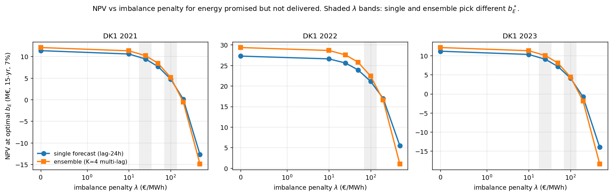
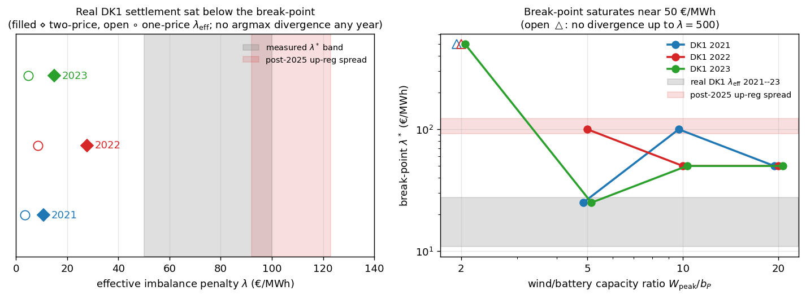
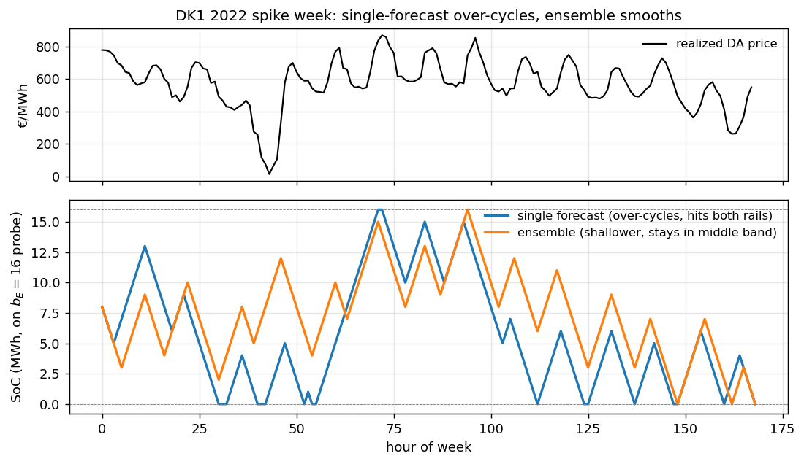

# forecast-aware-sizing

**Do you need good forecasts to pick the right battery size?**

You're building a battery (maybe next to a wind farm). Two separate
decisions:

- **How to operate it** — better price forecasts always pay here:
  0.9–37% more lifetime revenue in our tests.
- **How big to build it** — surprisingly, forecast quality mostly
  does **not** change this answer. The cheap deterministic dispatch
  model inside academic sizing tools picks the same capacity as a
  stochastic dispatcher… until one thing enters the picture: a
  **penalty for energy you promised but didn't deliver**.

Once that imbalance penalty exceeds a break-point (≈50–100 €/MWh,
depending on how much wind you have per MW of battery), better
forecasts buy you a *smaller battery* — up to 33% less capacity for
the same job:



*Each panel: lifetime NPV at the best battery size, as the imbalance
penalty grows, for a cheap point forecast (blue) vs a better ensemble
forecast (orange). In the grey bands the two pick different optimal
sizes — that's where forecast quality drives the capacity decision.*

**Where does reality sit?** We settled the same plant against *actual*
Danish (DK1) imbalance prices. In 2021–2023 the effective penalty was
only 11–28 €/MWh — below the break-point even during the 2022 energy
crisis, so cheap-forecast sizing got the capacity right. Then the
March-2025 Nordic balancing reforms lifted average up-regulation
spreads to 92–123 €/MWh — **wind-heavy plants crossed the line**, into
the regime where forecast quality decides how big a battery to build:



**Why does a better forecast shrink the battery?** Watch the same
16 MWh battery dispatch the same crisis week with two forecast
qualities:



The cheap forecast (blue) chases phantom price spikes and slams the
battery into both rails — full and empty — leaving no headroom to
absorb wind-forecast misses. The ensemble (orange) stays in the middle
band, keeping headroom free. Headroom is what soaks up delivery errors,
so the better forecast needs less battery to avoid the same penalties.

---

## Background

Why was this ever in doubt? Because the two communities that touch this
problem run different math. Academic sizing tools (DTU hydesign, NREL
REopt, PyPSA) embed deterministic-LP inner dispatch with point
forecasts; commercial operators (Tesla Autobidder, Fluence Mosaic,
Wärtsilä GEMS) dispatch tens of GW with ML-driven stochastic
optimization. Until now there was no empirical test of whether the
academic shortcut produces the wrong **capacity** recommendation.

**Answer.** With no imbalance settlement (the pure-merchant limit),
optimal capacity is identical across cheap and stochastic dispatch in
**17 of 18 regimes** on DK1 and ERCOT North Hub, 2021–2023 — including
the 2022 EU energy crisis and Storm Uri. With imbalance settlement, a
break-point appears: ≈25–100 €/MWh at a 5:1 wind/battery ratio,
saturating near 50 €/MWh for wind-heavier plants. Real DK1 settlement
sat below it through 2023; the March-2025 reforms moved wind-heavy
plants past it.

Full writeup: `paper/paper.pdf` (18 pages, submission draft).

## Heilmeier Catechism

**What are we trying to do?** Tell a battery developer whether their sizing tool's perfect-foresight-LP assumption is good enough on their specific market — without making them rerun the whole sizing exercise under a stochastic dispatcher.

**How is it done today.** Two camps. Academic sizing tools (hydesign, REopt, PyPSA) call a deterministic LP inner solver $10^3$–$10^4$ times per design evaluation; switching to a stochastic LP costs $100$–$1000\times$ more compute per evaluation. Commercial operators run ML-driven stochastic optimization at dispatch time (tens of GW deployed). Two communities, two architectures, no empirical test of whether the academic shortcut affects the capacity recommendation it produces.

**What is new.** (1) A practitioner-runnable regime-classification diagnostic — the $b_{\mathrm{sat}}^{\epsilon}$ overlap test — computable on one year of price data; returns {invariance survives, disjoint, inconclusive}. (2) First empirical sweep comparing deterministic-LP vs.\ stochastic dispatch sizing on DK1 + ERCOT North Hub, 2021-2023, with three orthogonal LUMI HPC stress tests (2-D $(b_E, b_P)$ surface, K=20 quantile-regression ensemble, N=50 scenario SLP). (3) Off-the-shelf-cost characterization of hydesign defaults applied to a merchant battery. (4) Imbalance-penalty extension that recovers a forecast-quality-dependent break-point in sizing, mapped across wind/battery ratios. (5) Real-settlement anchor: the same residuals settled against actual eSett DK1 imbalance prices, locating where the market sits relative to the break-point — below it through 2023, at/above it for wind-heavy plants after the March-2025 reforms.

**Who cares.** Anyone running hydesign / REopt / PyPSA for grid-tied battery sizing (40+ GW of hybrid-power-plant projects in pipeline use these tools). Knowing whether your market sits below or above $\lambda^*$ tells you whether your deterministic-LP sizing answer is robust or off by $\sim 50\%$ on capacity.

**Risks.** (1) Persistence ensemble is a weak stochastic baseline; richer forecasts can break invariance — partially confirmed by quantile-regression ensemble on DK1 2022; wind-side skilled forecasts at $\lambda > 0$ untested. (2) Only DK1 + ERCOT North Hub tested; CAISO, PJM, Nord Pool intraday have different structure; real-settlement anchor is DK1-only. (3) Break-point depends on plant configuration — measured to be non-increasing and saturating near 50 €/MWh in wind/battery ratio (not inverse, as initially conjectured).

**Cost.** Diagnostic runs on a laptop in minutes. Stress tests $\sim 50$ node-h on LUMI HPC (research allocation, no marginal cost).

**Time.** Six months: pre-registered design, dataset acquisition (Energinet + gridstatus), four dispatch policies, three stress tests, hydesign baseline integration, imbalance-penalty extension, paper write-up. Workshop draft ready for submission.

**Mid-term exam.** Diagnostic returns "invariance survives" on synthetic AR(1) where invariance must hold by construction. ✓
**Final exam.** Diagnostic correctly fires "disjoint" on the one stress-test regime (of 18) where sizing actually shifts (DK1 2022 quantile ensemble). ✓ Imbalance break-point reproducible across years (3/3 DK1 years; saturates ≈50 €/MWh at wind-heavy ratios). ✓ Under *real* DK1 settlement (effective penalty 11–28 €/MWh, below break-point) the diagnostic predicts invariance — and sizing is indeed invariant, all 3 years, both settlement regimes. ✓

## Headline results

| Test | Result |
|---|---|
| Argmax invariance, persistence ensemble, 6 (market, year) | **6/6 survive** at $\lambda=0$ |
| Argmax invariance, 3 LUMI stress tests × 6 regimes (18 total) | **17/18 survive**; DK1 2022 quantile-K=20 breaks |
| Hydesign-default operational constraints vs unrestricted LP | **5.5–35.9% NPV gap** at argmax; $b_E^*$ shifts 2/6 regimes |
| Imbalance-penalty break-point (5 MW wind + 1 MW battery, DK1) | $\lambda^* \approx 100$ EUR/MWh on **all 3 years**; single $24$ MWh, ensemble $16$ MWh |
| Break-point vs wind/battery ratio (W = 1/2/5/10/20 MW) | non-increasing, **saturates ≈50 €/MWh** for ratios ≥ 10 |
| Real DK1 settlement (eSett two-price + one-price), 2021–23 | effective penalty **11–28 €/MWh**, below break-point; **sizing invariant all 3 years** |
| Operational stochastic-dispatch realized-NPV uplift at $b_E^*$ | **0.9–37%** across (market, year) |

## Repo layout

(formerly `battery_gym`; prior RL-ELM degradation reproduction kept under `rl_elm/`.)

```
forecast-aware-sizing/
├── paper/              workshop paper source + figures
│   ├── paper.tex
│   ├── paper.pdf
│   └── figures/        fig_paper_*.png  (referenced via \graphicspath)
├── sizing/             workshop paper code (flat package)
│   ├── env.py, arbitrage_agents.py, b_sat_classifier.py
│   ├── dk_loader.py, ercot_loader.py, price_signal.py, spectrum.py
│   ├── hydesign_merchant_fork.py, hydesign_local_check.py
│   ├── paper_benchmark.py, paper_2d_task.py, paper_quantile.py,
│   ├── paper_slp.py, paper_timeseries.py, paper_hydesign.py,
│   ├── paper_imbalance.py, paper_stress_figures.py, paper_figures.py
│   └── sanity_*.py
├── rl_elm/             prior project: degradation-aware RL (see below)
├── results/            tracked JSON outputs (2d/, quantile/, slp/,
│                       hydesign/, imbalance/, main/, gbar/)
├── scripts/lumi/       Slurm submission scripts (2d, quantile, slp, run)
├── scripts/gbar/       LSF (DTU gbar) scripts
├── docs/memos/         design + kill memos
├── docs/preregistrations/  pre-registered amendments
├── tests/              pytest entry points
├── data/               raw market data (gitignored cache)
└── README.md, pixi.toml
```

## Reproduce

```bash
pixi install
# Workshop paper §4 (main invariance test)
pixi run python sizing/paper_benchmark.py
# §4.6 hydesign-default off-the-shelf baseline
pixi run python sizing/paper_hydesign.py --source dk1 --year 2022 \
    --out results/hydesign/dk1_2022.json
# §5.2 imbalance-penalty break-point
pixi run python sizing/paper_imbalance.py --year 2022 \
    --out results/imbalance/dk1_2022.json
# All paper figures (writes into paper/figures/)
pixi run python sizing/paper_stress_figures.py
# Compile paper.pdf  (graphicspath = {figures/})
cd paper && pdflatex paper.tex
```

LUMI stress tests (§4-§5): `sbatch scripts/lumi/2d.sh`, `scripts/lumi/quantile.sh`, `scripts/lumi/slp.sh`. gbar (DTU): `scripts/gbar/run.sh deploy`.

---

## Prior work in this repo: RL-ELM degradation-aware regulation

Reproduction of Srinivasa, Deulkar, Bhargava, Hajiesmaili, Shenoy 2026,
*"Degradation-Aware Frequency Regulation of a Heterogeneous Battery Fleet via
Reinforcement Learning"* (arXiv:2601.22865v2). Self-contained below.

### Files

- `env.py` — fleet MDP env. Per-battery ramp + capacity (eq 1, 3), collective
  regulation tracking (eq 6), deterministic SoC update (eq 2), online rainflow
  switching-point tracker (sec 3.5).
- `reg_signal.py` — Markov regulation signal over `S_r = {-4, -1, 1, 5}`. (Paper
  does not specify the transition matrix; we use a sticky mean-reverting DTMC.)
- `degradation.py` — rainflow cycle counting + footnote-7 stress function
  `f(δ) = (k1·δ^k2 + k3)^-1` with `k1=1.4e5, k2=-0.501, k3=-1.23e5`.
- `agents.py` — Naive (eq 19), Greedy (eq 20), Tabular Q-learning (sec 4.1),
  ELM-RL (sec 4.4-4.5) with SiLU activation, fixed random `W,b`, replay buffer,
  minibatch semi-gradient TD.
- `run.py` — driver. Trains each agent, evaluates on a fresh signal seed, computes
  accumulated reward + per-battery rainflow degradation + DoD histogram.
- `plot_results.py` — DoD histogram (Fig 2-style).

### Reproduce

```bash
pip install rainflow numpy matplotlib
python3 rl_elm/run.py --B 2 3 --c 2 3 --d 2 3 --T 100000
python3 rl_elm/plot_results.py results.json fig_dod.png
```

### Validation outcome (B=(2,3), c=d=(2,3), T=10^5, 3 signal seeds: 42, 7, 123)

| Agent     | Reward             | D₁              | D₂              | D₁+D₂           |
|-----------|-------------------:|----------------:|----------------:|----------------:|
| Naive     | -6044.6 ± 4.4      | 0.288 ± 0.001   | 0.244 ± 0.001   | 0.532 ± 0.001   |
| Greedy    | -6017.6 ± 3.9      | 0.282 ± 0.001   | 0.233 ± 0.001   | 0.515 ± 0.000   |
| Tabular Q | -6034.4 ± 21.1     | 0.256 ± 0.054   | 0.252 ± 0.033   | **0.508 ± 0.022** |
| ELM-RL    | -6027.5 ± 4.4      | 0.299 ± 0.014   | 0.235 ± 0.005   | 0.534 ± 0.009   |

What matches the paper qualitatively:
- Sanity: my feasible-action count summed over `S` is 77 for B=(2,3); paper's
  Table-1 entry `|S × A| = 420` is the **unconstrained** product
  `∏(B_i+1)·∏(c_i+d_i+1)` (ignores the eq-6 collective constraint and `|S_r|`).
- Greedy reliably beats Naive (~3% reduction in summed degradation, σ = 0.001).
  Direction matches Table 1.
- Tabular Q is the best agent on summed degradation (0.508 vs Naive 0.532).
  Order is **Tabular Q < Greedy < Naive**, matching the paper's tabular row.
- DoD histograms (`fig_dod_tuned.png`) reproduce Fig 2 qualitatively. Tabular Q
  shifts cycle mass from `DoD ≈ 1.0` toward `DoD ≈ 0.5–0.7`.
- Stress function reproduces depth-monotone shape from Wankmüller et al. 2017
  (footnote 7).

What does **not** match the paper:
- **ELM-RL does not improve over Naive at this small config** (0.534 vs 0.532).
  Paper Table 1 row (2,3) reports `D ≈ 0.02` per battery for RL-ELM — a ~85%
  improvement over Naive. With my hyperparameters (hidden=100, α=2e-3, ε₀=0.6,
  linear decay) ELM's bias and variance are both worse than tabular's at this
  scale. The framework is correct (tabular wins), but ELM's headline advantage
  in the paper (scaling to large state spaces) cannot be quantitatively replicated
  without fitting the unspecified hyperparameters.
- **Tabular Q has high cross-seed variance** in per-battery D (σ ≈ 0.05 vs
  Naive σ ≈ 0.001). It often converges to an asymmetric policy that uses one
  battery as the variation buffer; the asymmetry direction flips between seeds,
  so the mean-per-battery is balanced even though individual seeds are not.
- **Absolute D values are ~10× larger than the paper's**. The stress-function
  constants from footnote 7 are reproduced exactly, but the paper does not
  pin down the units convention (δ as fraction vs. percent); the unspecified
  Markov transition matrix for the toy signal also differs from theirs.

### Implementation note: SP-update timing

Eq (9) reads `r(t) = -(α e^{β|b(t)+a(t)-b_SP(t)|} - α e^{β|b(t)-b_SP(t)|})`.
A literal "compute reward, then update SP" ordering is **gameable**: after a
direction reversal, `b_SP` slides to the just-passed extremum, and the next
reversal step rewards the agent `+α(e^{β·B}−1)` for collapsing the deviation
back to zero — sustained full-amplitude oscillation pays positive reward every
step. Tabular Q under that ordering pegs at DoD=1.0 and degrades worse than
Naive.

The intended ordering (per §3.5: "switching points can be detected and updated
incrementally by monitoring changes in the direction of SoC evolution") is to
update the rainflow stack **first** with the new SoC, push the freshly-confirmed
extremum, then evaluate the reward against that updated SP. Under this ordering,
every step of full-amplitude oscillation costs `α(e^{β·B}−1)`; depth-1
oscillation costs `α(e^β−1)` per step; no motion costs 0. RL prefers shallow
cycles. `env.step()` and `agents.proxy_reward_for_action()` use this ordering.

### Files produced

- `results.json` — per-agent metrics + full SoC traces from the latest run.
- `fig_dod_tuned.png` — DoD histograms equivalent to paper Fig 2.
- `fig_headline.png` — repro.py output: per-battery DoD at B=(10,100).
- `fig_soc_traces.png` — Naive vs ELM SoC time series, B=(10,100), 1000 steps.
- `fig_dod_grid.png` — 5-config × 2-battery DoD grid (Naive vs ELM).
- `fig_action_match.png` — bar chart: ELM matches Greedy 95.7-99.6% on held-out states.
- `fig_proxy_vs_d.png` — scatter of cumulative proxy R vs rainflow D across 5 configs × 2 seeds.

Regenerate the last four with `python plot_all.py` (uses cached run artifacts).

### Honest framing

ELM-RL is, in practice, a **smooth function-approximator copy of Greedy** on
this proxy reward. Action-match analysis (`action_match.py`) shows ELM picks
the same action as Greedy 95.7-99.6% of the time on held-out trajectories at
B=(2,50) and B=(10,100). Per-step degradation is identical to 4 decimals.

| Config         | Seed | ELM≡Greedy match | sign-match | D_ELM | D_Greedy |
|----------------|-----:|----------------:|-----------:|------:|---------:|
| B=(2, 50)      | 42   | **99.5%**       | 99.8%      | 0.0165| 0.0165   |
| B=(2, 50)      |  7   | **99.6%**       | 99.9%      | 0.0170| 0.0170   |
| B=(10, 100)    | 42   | 95.7%           | 97.8%      | 0.0086| 0.0085   |
| B=(10, 100)    |  7   | 97.4%           | 98.8%      | 0.0085| 0.0085   |

So the headline result ("ELM beats Naive 17-74%") is real, but the mechanism
is `ELM ≈ Greedy ≫ Naive`, not multi-step temporal-difference credit
assignment. The win comes from the **proxy reward** plus the heterogeneous
fleet structure -- not from RL discovering a non-myopic policy. RL would only
provide additional value if (a) the reward were sparse (e.g., true rainflow
on cycle completion), (b) the dynamics had hidden state RL needs to model, or
(c) the action enumeration itself were intractable.

Note that ELM does **not** beat Greedy on compute either: both enumerate
feasible actions per state. ELM's per-action cost is one ELM forward pass;
Greedy's is one proxy-reward formula evaluation. They scale identically in N.

### Headline (one command, ~5 min on a laptop)

```bash
pixi run python rl_elm/repro.py
```

Trains ELM-RL on B=(10,100) heterogeneous fleet, then plots per-battery DoD
histograms (`fig_headline.png`): Naive over-cycles the small battery (mass at
high DoD); ELM-RL redistributes regulation across the fleet so the small
battery stays shallow. Total degradation drops ~55% vs Naive.

### Heterogeneous fleet result

Symmetric fleets (B=(N,N) with c=d) hit a structural ceiling: at large N,
Naive's proportional allocation is near-optimal under the proxy reward, so
Greedy ≈ Naive and no RL can do better. Heterogeneous fleets (asymmetric
capacity / ramp) break this — Naive over-cycles the small battery.

Heterogeneous results (T=200k, 2 seeds, quad_growth reward, ELM with per-batt
normalization + rich features [(b−sp), |b−sp|, sign, one-hot signal]):

| Config       | Naive D | Greedy D | ELM-RL D | ELM vs Naive | ELM vs Greedy |
|--------------|--------:|---------:|---------:|-------------:|--------------:|
| B=(5, 20)    | 0.474   | 0.353    | 0.391    | **+17.4%**   | −10%          |
| B=(2, 20)    | 0.737   | 0.364    | 0.376    | **+49.0%**   | −3.5%         |

ELM nearly matches the analytic Greedy optimum at maximum heterogeneity.

### Sanity checklist

- [x] Closed-form sanity (`tests/sanity.py` — 11 tests, all passing). Covers
  stress-fn monotonicity, rainflow on constant / single-cycle / N-fixed-depth
  trajectories, SP-tracker invariants, env SoC update, feasible-action
  enumeration, zero-policy → D=0.
- [x] Multi-seed reporting (`multi_seed.py`).
- [x] ELM hyperparam sweep (`elm_sweep.py`) at B=(2,3), T=30k screening.
- [x] Mid-scale check (`scale_check.py`) at B=(10,10) and (20,20).
- [x] Pixi env (`pixi.toml`).
- [x] ELM checkpoint + per-step training log hooks (`agent.train(log_every=...,
  checkpoint_path=...)`).
